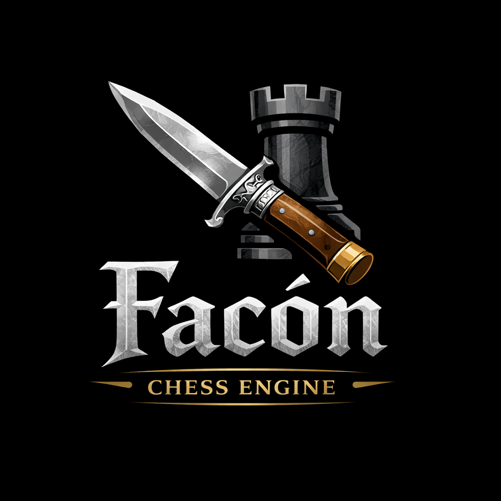

# Facón Chess Engine

<p align="center">
  
</p>

A UCI-compliant chess engine written in C++17.

*by Carlos M. Canavessi*


---

## About

Facón is a chess engine built from scratch in C++17, designed as a learning project and long-term development platform. The name comes from the *facón* — a traditional Argentine gaucho knife, forged by hand, raw and functional.

Each version carries a codename that follows the knife-making process: from rough rusty iron to a sharp, precise blade.

---

## Current Version: 1.3 "Yunque"

> *The anvil. Where the blade takes shape.*

The fourth release, focused on search selectivity, pawn structure evaluation, and time management intelligence. Measured at **+200 Elo** over version 1.2 (Ordo ~1900, gauntlet 1040 games at 2min+1sec).

### What's new in 1.3

- **Late Move Reductions (LMR)** — quiet moves searched after the first few are searched at reduced depth. If they surprise by raising alpha, they are re-searched at full depth. Formula: `log(depth) * log(move) / 2.25`.
- **History heuristic** — quiet moves that cause beta cutoffs accumulate a score (`depth^2`), improving ordering over time and making LMR more effective.
- **Aspiration windows** — iterative deepening searches with a narrow window around the previous score. On failure, widens only in the failing direction.
- **Pawn structure evaluation** — five terms via bitboard operations: isolated (-15cp), doubled (-15cp), backward (-12cp), passed (rank-scaled bonus up to +80cp), connected (+8cp).
- **Smart time management** — quadratic depth scaling for extensions (low-depth PV changes have near-zero effect), easy move reduction (mate found, forced move, stable PV for 7+ iterations), and an emergency hard limit raise for genuinely complex positions at depth 25+.
- **Mopup insufficient material guard** — K+B vs K and K+N vs K correctly recognized as drawn instead of activating corner-chasing.
- **Centralized versioning** — `PROJECT_VERSION` and `FACON_CODENAME` in CMakeLists.txt control all version strings via `configure_file`.
- **`perft` command** — movegen validation with bulk-counting optimization. `perft divide` for per-move breakdown.
- **Bug fixes** — aspiration window fail-low squeezing beta (yo-yo effect), mate reduction firing repeatedly (soft limit collapse), race condition in `ucinewgame`, castling SAN missing check/mate markers.

---

## Version History

| Version | Codename   | Ordo Elo | Gain |
|---------|------------|----------|------|
| 1.3     | Yunque     | ~1900    | +200 vs 1.2 |
| 1.2     | Rojo Vivo  | ~1700    | +340 vs 1.1 |
| 1.1     | Herrumbre  | ~1360    | +140 vs 1.0 |
| 1.0     | Óxido      | ~1220    | baseline |

Gauntlet methodology: 26 opponents, 40 games each (1040 total), 2min+1sec, balanced opening book. Ordo rating computed across all versions in a combined rating list.

---

## Build

### Requirements
- C++17 compiler (GCC 10+ or Clang 12+)
- CMake 3.16+

### Linux
```bash
mkdir build-linux && cd build-linux
cmake .. -DCMAKE_BUILD_TYPE=Release
make -j$(nproc)
```

### Linux (optimized for your CPU, not distributable)
```bash
cmake .. -DCMAKE_BUILD_TYPE=Release -DNATIVE=ON
make -j$(nproc)
```

### Windows (cross-compile from Linux)
```bash
sudo apt install mingw-w64
mkdir build-windows && cd build-windows
cmake .. \
  -DCMAKE_TOOLCHAIN_FILE=../cmake/windows-cross.cmake \
  -DCMAKE_BUILD_TYPE=Release
make -j$(nproc)
```

The resulting binary (`facon-1.3` / `facon-1.3.exe`) is statically linked and has no external dependencies.

---

## Usage

Facón communicates via the UCI protocol. Any UCI-compatible GUI works: [Arena](http://www.playwitharena.de/), [Cute Chess](https://cutechess.com/), [Banksia](https://banksiagui.com/).

### Quick start
```
$ ./facon-1.3
uci
id name Facon 1.3 - Yunque
id author Carlos M. Canavessi
option name Hash type spin default 16 min 1 max 1024
uciok
isready
readyok
position startpos
go movetime 2000
info depth 1 seldepth 1 score cp 30 nodes 20 nps 0 time 0 hashfull 0 pv b1c3
...
bestmove b1c3
```

### Supported UCI options

| Option | Type | Default | Description |
|--------|------|---------|-------------|
| `Hash` | spin | 16 | Transposition table size in MB (1-1024) |

---

## Project Structure

```
facon/
├── src/
│   ├── types.h         — Core types: Square, Piece, Move, Bitboard
│   ├── bitboard.h/.cpp — Magic bitboards, attack tables
│   ├── board.h/.cpp    — Board state, make/unmake, Zobrist hashing
│   ├── movegen.h/.cpp  — Pseudo-legal move generation
│   ├── eval.h/.cpp     — Material + PST + king safety + mopup + pawn structure
│   ├── tt.h/.cpp       — Transposition table
│   ├── timeman.h/.cpp  — Time management
│   ├── search.h/.cpp   — Negamax alpha-beta, LMR, NMP, aspiration windows, ID
│   ├── uci.h/.cpp      — UCI protocol handler
│   ├── main.cpp        — Entry point
│   ├── version.h.in    — Version header template (CMake-generated)
│   └── version.rc.in   — Windows version resource template
├── cmake/
│   └── windows-cross.cmake
├── docs/
│   ├── v1.0.md         — Technical documentation for v1.0
│   ├── v1.1.md         — Technical documentation for v1.1
│   ├── v1.2.md         — Technical documentation for v1.2
│   └── v1.3.md         — Technical documentation for v1.3
├── CMakeLists.txt
├── CHANGELOG.md
└── README.md
```

---

## Planned improvements

- **Search**: check extensions, singular extensions, SEE pruning, LMR table precalculation
- **Evaluation**: mobility, open files, rook on 7th, bishop pair, Texel tuning
- **Time management**: `movestogo` support, further easy-move calibration
- **Architecture**: make/unmake approach (eliminate board copy in is_legal), incremental evaluation, Syzygy tablebases, NNUE (long-term)

---

## Author

**Carlos M. Canavessi**

---

## Acknowledgements

- [Chess Programming Wiki](https://www.chessprogramming.org/) — reference for all chess engine techniques
- [CCRL](https://www.computerchess.org.uk/ccrl/) — computer chess rating list
