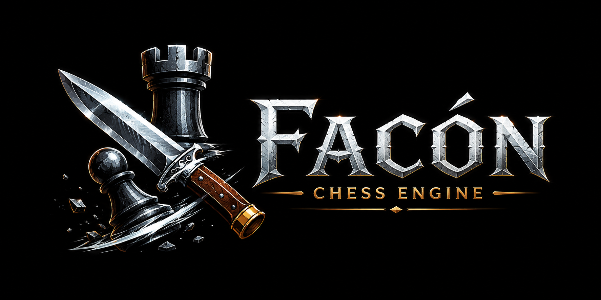

# Facón Chess Engine
<!-- Last modified: 2026-06-11 18:05 -->

<p align="center">
  
</p>

A UCI-compliant chess engine written in C++17.

*by Carlos M. Canavessi*


---

## About

Facón is a chess engine built from scratch in C++17, designed as a learning project and long-term development platform. The name comes from the *facón* — a traditional Argentine gaucho knife, forged by hand, raw and functional.

Each version carries a codename that follows the knife-making process: from rough rusty iron to a sharp, precise blade.

---

## Current Version: 1.6 "Temple"

> *The tempering. Heat and quench -- where the blade gains its hardness and its spring.*

The seventh release, focused on a deliberate evaluation overhaul: every tunable weight centralized into a single vector and optimized with Texel tuning, phase-tapered piece-square tables, and three new evaluation feature groups (pawn shelter/storm, a second king-safety layer, and a positional refinement group). Measured at approximately **+250 Elo** over version 1.5 (Ordo ~2800); +222.8 Elo in direct self-play vs 1.5 (n=10000). Startup is now effectively instant thanks to hardcoded magic numbers.

### What's new in 1.6

- **Weight centralization + Texel tuning** — every evaluation weight collected into a single flat array (934 entries) and optimized with Texel tuning on a labeled quiet-position dataset. Material folded into the PSTs post-tune, so `PIECE_VALUE` stays fixed while the evaluation reproduces the tuned values.
- **Tapered piece-square tables** — each PST square now holds separate middlegame and endgame values, blended by game phase. Lets the evaluation express phase-dependent placement (king centralization, advanced pawns, etc.).
- **Pawn shelter / storm** — new tunable group scoring the pawn cover in front of each king (shelter, by rank gap) and enemy pawns advancing on the king's files (storm, by advancement).
- **Second king-safety layer** — open/semi-open files toward the king and safe-check squares per piece type, complementing the existing attacker-count king safety.
- **Tempo** — a bonus for the side to move. +19 Elo, the single most valuable feature added in 1.6.
- **Bishop outpost** — a bishop on an advanced square no enemy pawn can challenge, with a larger bonus when pawn-supported. Mirrors the knight outpost. +6.6 Elo.
- **Passed-pawn refinement** — king proximity (escort your passer, keep the enemy king away), blockade (enemy piece on the stop square; a minor blockades better than a major), free path to promotion, and pawn protection. +10.6 Elo as a group.
- **Hardcoded magic numbers** — the bishop/rook magics, previously searched at startup, are now baked-in constants. Startup dropped from ~261 ms to ~11 ms (~96% faster); attacks are bit-identical. The search is preserved under a compile flag for offline regeneration.
- **`trace` UCI command** — prints the linear coefficient decomposition of the evaluation and the engine-vs-trace fidelity check, complementing the `eval` command from 1.5.

### Features attempted and rejected in 1.6

- **Rook behind passed pawn (Tarrasch rule)** — -9 Elo; redundant with the rook PST.
- **Non-linear mobility** — -12 Elo; overfit, the linear mobility is more robust.
- **Material imbalance (Kaufman-style)** — approximately neutral; the tuning redistributed existing PST value rather than adding signal, and self-play confirmed redundancy.

---

## Version History

| Version | Codename   | Ordo Elo | Gain |
|---------|------------|----------|------|
| 1.6     | Temple     | ~2800 | +250 vs 1.5 |
| 1.5     | Espiga     | ~2550    | +220 vs 1.4 |
| 1.4     | Hoja       | ~2330    | +430 vs 1.3 |
| 1.3     | Yunque     | ~1900    | +200 vs 1.2 |
| 1.2     | Rojo Vivo  | ~1700    | +340 vs 1.1 |
| 1.1     | Herrumbre  | ~1360    | +140 vs 1.0 |
| 1.0     | Oxido      | ~1220    | baseline |

Gauntlet methodology: 26 opponents, 40 games each (1040 total), 2min+1sec, balanced opening book. Ordo rating computed across all versions in a combined rating list. 1.6 was tested against a high-Ordo field (Gauntlet 4); the combined-list Ordo places it in the 2800 range, and direct self-play vs 1.5 measured +222.8 Elo (n=10000).

---

## Build

### Requirements
- C++17 compiler (GCC 10+ or Clang 12+)
- CMake 3.16+

### Linux
```bash
mkdir build-linux && cd build-linux
cmake .. -DCMAKE_BUILD_TYPE=Release
make -j$(nproc)
```

### Linux (optimized for your CPU, not distributable)
```bash
mkdir build-linux && cd build-linux
cmake .. -DCMAKE_BUILD_TYPE=Release -DNATIVE=ON
make -j$(nproc)
```

### Windows (cross-compile from Linux)
```bash
sudo apt install mingw-w64
mkdir build-windows && cd build-windows
cmake .. \
  -DCMAKE_TOOLCHAIN_FILE=../cmake/windows-cross.cmake \
  -DCMAKE_BUILD_TYPE=Release
make -j$(nproc)
```

The resulting binary (`facon-1.6` / `facon-1.6.exe`) is statically linked and has no external dependencies.

---

## Usage

Facón communicates via the UCI protocol. Any UCI-compatible GUI works: [Arena](http://www.playwitharena.de/), [Cute Chess](https://cutechess.com/), [Banksia](https://banksiagui.com/).

### Quick start
```
$ ./facon-1.6
uci
id name Facon 1.6 - Temple
id author Carlos M. Canavessi
option name Hash type spin default 16 min 1 max 1024
uciok
isready
readyok
position startpos
go movetime 2000
info depth 1 seldepth 1 score cp 37 nodes 41 nps 0 time 0 hashfull 0 pv g1f3
...
bestmove g1f3
```

### Supported UCI options

| Option | Type | Default | Description |
|--------|------|---------|-------------|
| `Hash` | spin | 16 | Transposition table size in MB (1-1024) |

### Non-UCI commands

| Command | Description |
|---------|-------------|
| `eval`  | Print a per-component breakdown of the static evaluation for the current position. |
| `trace` | Print the linear coefficient decomposition of the evaluation (the per-weight multipliers used by Texel tuning) and an engine-vs-trace fidelity check. |
| `bench` | Run the benchmark on 10 hand-crafted positions; reports per-position nodes and total NPS. `bench verbose` for full search output, `bench depth N` to override the default depth (18). Also available as a command-line invocation (`./facon-1.6 bench`) which runs the benchmark and exits without entering the UCI loop. |
| `perft N` | Count leaf nodes to depth N from the current position. `perft divide N` for per-first-move breakdown. |
| `d` | Print the current board state. |

---

## Project Structure

```
facon/
├── src/
│   ├── types.h         — Core types: Square, Piece, Move, Bitboard, move_to_uci()
│   ├── bitboard.h/.cpp — Magic bitboards, attack tables
│   ├── board.h/.cpp    — Board state, make/unmake, Zobrist hashing, all_attackers_to()
│   ├── movegen.h/.cpp  — Pseudo-legal move generation (captures include quiet queen promotions)
│   ├── eval.h/.cpp     — Tapered, Texel-tuned evaluation: material+PST (folded), king safety (two layers), shelter/storm, mopup, pawn structure, tropism, positional2 (tempo, bishop outpost, passed-pawn refinement), evaluate_verbose, trace_evaluate
│   ├── tt.h/.cpp       — Transposition table (depth-preferred replacement, generation/aging)
│   ├── timeman.h/.cpp  — Time management
│   ├── search.h/.cpp   — Negamax, LMR, NMP, SEE, futility, razoring, LMP, IIR, countermove, ID
│   ├── uci.h/.cpp      — UCI protocol handler, bench, eval, perft commands
│   ├── main.cpp        — Entry point
│   ├── version.h.in    — Version header template (CMake-generated)
│   └── version.rc.in   — Windows version resource template
├── cmake/
│   └── windows-cross.cmake
├── assets/
│   └── logos/
│       ├── facon-banner.png  — Repository banner (2:1)
│       └── Logo.svg          — Source vector logo
├── docs/
│   ├── v1.0.md         — Technical documentation for v1.0
│   ├── v1.1.md         — Technical documentation for v1.1
│   ├── v1.2.md         — Technical documentation for v1.2
│   ├── v1.3.md         — Technical documentation for v1.3
│   ├── v1.4.md         — Technical documentation for v1.4
│   ├── v1.5.md         — Technical documentation for v1.5
│   └── v1.6.md         — Technical documentation for v1.6
├── CMakeLists.txt
├── CHANGELOG.md
└── README.md
```

---

## Author

**Carlos M. Canavessi**

---

## Acknowledgements

- [Chess Programming Wiki](https://www.chessprogramming.org/) — reference for all chess engine techniques
- [CCRL](https://www.computerchess.org.uk/ccrl/) — computer chess rating list
- [Gediminas Masaitis' texel-tuner](https://github.com/GediminasMasaitis/texel-tuner) — the Texel tuning framework used to optimize Facon's evaluation weights in 1.6
