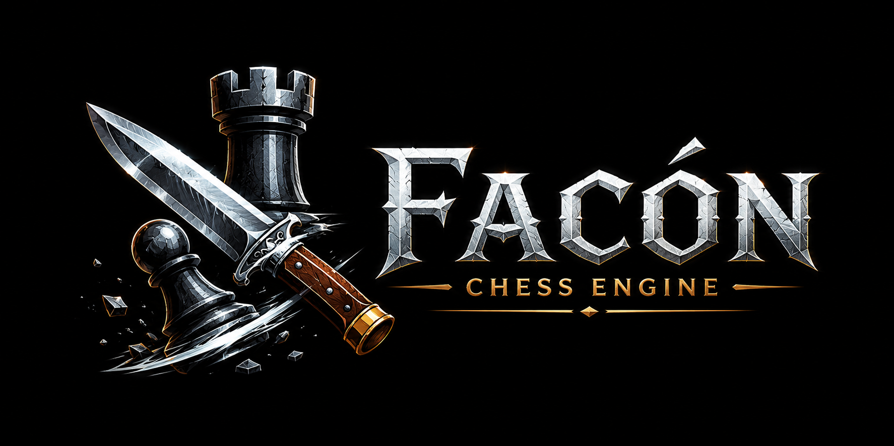

# Facón Chess Engine
<!-- Last modified: 2026-10-04 00:08 -->

<p align="center">
  
</p>

A UCI-compliant chess engine written in C++17.

*by Carlos M. Canavessi*


---

## About

Facón is a chess engine built from scratch in C++17, designed as a learning project and long-term development platform. The name comes from the *facón* — a traditional Argentine gaucho knife, forged by hand, raw and functional.

Each version carries a codename that follows the knife-making process: from rough rusty iron to a sharp, precise blade.

---

## Current Version: 1.7 "Filo"

> *The edge. Whetstone and patience -- where hardness finally becomes sharpness.*

The eighth release, and the largest gain since the engine's early days -- split almost evenly between search and evaluation, with no single change dominating. On the search side: a family of history tables, a static evaluation cached in the transposition table that also drives improving-aware pruning, singular extensions, ProbCut, and a pawn-structure cache. On the evaluation side: threat evaluation by attacker and victim, endgame scaling that resolves the drawn-pawnless-ending limitation carried since 1.5, and a re-fitted weight set. Measured at approximately **+130 Elo** over version 1.6 (Ordo ~2930); +139.1 Elo in direct self-play vs 1.6 (n=10000).

### What's new in 1.7

- **Two-sided history** -- the butterfly history table now penalizes the quiet moves searched before the one that caused a cutoff, as well as rewarding that one, with a gravity update that decays entries instead of saturating them. +15 Elo.
- **Continuation history** -- a second history table conditioned on the opponent's previous move: how good a move has been as a reply to that specific move. +25 Elo.
- **Static evaluation in the transposition table** -- every position outside check gets a static evaluation, cached in the table at no size cost. The search uses it to tell whether its position is improving, and modulates reverse futility, futility and late-move pruning accordingly. +20 Elo.
- **Singular extensions** -- when the transposition table shows one move to be the only good one, that move is searched one ply deeper. +5 Elo.
- **ProbCut** -- a shallow search of a sound capture that already beats beta by a margin cuts the node early. Slightly positive; kept for the tree reduction it gives at depth.
- **Pawn-structure cache** -- a second Zobrist key covering pawn placement alone, under which the pawn evaluation is cached. +20 Elo from speed alone, with an unchanged benchmark signature.
- **Threat evaluation** -- what each side attacks, broken down by attacker and victim: pawns on minor and major pieces, minors on majors, rooks on the queen, undefended pieces, and pawn pushes that would create a threat. +50 Elo, the largest single gain of the release.
- **Endgame scaling** -- material configurations that cannot be converted (a lone minor, two knights, same-colored bishops, rook against a minor, opposite-colored bishops) are scaled toward a draw, never clamped to zero. +8 Elo, and resolves the drawn-pawnless-ending limitation carried since 1.5.
- **Re-fitted weight set** -- all 946 evaluation weights re-optimized after the threat terms were added. +6 Elo.

### Features attempted and rejected in 1.7

- **Capture history** -- roughly neutral over 16,250 games; the existing capture ordering already carried that signal.
- **History pruning** -- dropped before testing: the history signal is excellent for ordering moves and unsuitable as an absolute pruning threshold.
- **Principal variation search** (two forms) -- both measured negative; scouting traded the exact scores the transposition table relied on for bounds.
- **Correction history** -- never separated from zero.

---

## Version History

| Version | Codename   | Ordo Elo | Gain |
|---------|------------|----------|------|
| 1.7     | Filo       | ~2930    | +130 vs 1.6 |
| 1.6     | Temple     | ~2800 | +250 vs 1.5 |
| 1.5     | Espiga     | ~2550    | +220 vs 1.4 |
| 1.4     | Hoja       | ~2330    | +430 vs 1.3 |
| 1.3     | Yunque     | ~1900    | +200 vs 1.2 |
| 1.2     | Rojo Vivo  | ~1700    | +340 vs 1.1 |
| 1.1     | Herrumbre  | ~1360    | +140 vs 1.0 |
| 1.0     | Oxido      | ~1220    | baseline |

Gauntlet methodology: 26 opponents, 40 games each (1040 total), 2min+1sec, each opening played with both colors. Ordo rating computed across all versions in a combined rating list. 1.7 was measured against the same high-Ordo field as 1.6 (Gauntlet 4), so the two compare on identical opposition: the combined-list Ordo places 1.7 at ~2930, and direct self-play vs 1.6 measured +139.1 Elo (n=10000). A second gauntlet against a stronger field is being run with a balanced opening book. 1.6 was independently rated ~2800 on the CCRL Blitz list (1055 games), matching its gauntlet estimate.

---

## Build

### Requirements
- C++17 compiler (GCC 10+ or Clang 12+)
- CMake 3.16+

### Linux
```bash
mkdir build-linux && cd build-linux
cmake .. -DCMAKE_BUILD_TYPE=Release
make -j$(nproc)
```

### Linux (optimized for your CPU, not distributable)
```bash
mkdir build-linux && cd build-linux
cmake .. -DCMAKE_BUILD_TYPE=Release -DNATIVE=ON
make -j$(nproc)
```

### Windows (cross-compile from Linux)
```bash
sudo apt install mingw-w64
mkdir build-windows && cd build-windows
cmake .. \
  -DCMAKE_TOOLCHAIN_FILE=../cmake/windows-cross.cmake \
  -DCMAKE_BUILD_TYPE=Release
make -j$(nproc)
```

The resulting binary (`facon-1.7` / `facon-1.7.exe`) is statically linked and has no external dependencies.

---

## Usage

Facón communicates via the UCI protocol. Any UCI-compatible GUI works: [Arena](http://www.playwitharena.de/), [Cute Chess](https://cutechess.com/), [Banksia](https://banksiagui.com/).

### Quick start
```
$ ./facon-1.7
uci
id name Facon 1.7 - Filo
id author Carlos M. Canavessi
option name Hash type spin default 16 min 1 max 1048576
uciok
isready
readyok
position startpos
go movetime 2000
info depth 1 seldepth 1 score cp 32 nodes 41 nps 0 time 0 hashfull 0 pv g1f3
...
bestmove g1f3
```

### Supported UCI options

| Option | Type | Default | Description |
|--------|------|---------|-------------|
| `Hash` | spin | 16 | Transposition table size in MB (1-1048576) |

### Non-UCI commands

| Command | Description |
|---------|-------------|
| `eval`  | Print a per-component breakdown of the static evaluation for the current position. |
| `trace` | Print the linear coefficient decomposition of the evaluation (the per-weight multipliers used by Texel tuning) and an engine-vs-trace fidelity check. |
| `bench` | Run the benchmark on 10 hand-crafted positions; reports per-position nodes and total NPS. `bench verbose` for full search output, `bench depth N` to override the default depth (18). Also available as a command-line invocation (`./facon-1.7 bench`) which runs the benchmark and exits without entering the UCI loop. |
| `perft N` | Count leaf nodes to depth N from the current position. `perft divide N` for per-first-move breakdown. |
| `d` | Print the current board state. |

---

## Project Structure

```
facon/
├── src/
│   ├── types.h         — Core types: Square, Piece, Move, Bitboard, move_to_uci()
│   ├── bitboard.h/.cpp — Magic bitboards, attack tables
│   ├── board.h/.cpp    — Board state, make/unmake, Zobrist hashing (position and pawn keys), all_attackers_to()
│   ├── movegen.h/.cpp  — Pseudo-legal move generation (captures include quiet queen promotions)
│   ├── eval.h/.cpp     — Tapered, Texel-tuned evaluation: material+PST (folded), king safety (two layers), shelter/storm, mopup, pawn structure, tropism, positional2 (tempo, bishop outpost, passed-pawn refinement), threat evaluation, endgame scaling, pawn-structure cache, evaluate_verbose, trace_evaluate
│   ├── tt.h/.cpp       — Transposition table (depth-preferred replacement, generation/aging, cached static evaluation)
│   ├── timeman.h/.cpp  — Time management
│   ├── search.h/.cpp   — Negamax, LMR, NMP, SEE, futility, razoring, LMP, IIR, ProbCut, singular extensions, history (butterfly + continuation), countermove, ID
│   ├── uci.h/.cpp      — UCI protocol handler, bench, eval, perft commands
│   ├── main.cpp        — Entry point
│   ├── version.h.in    — Version header template (CMake-generated)
│   └── version.rc.in   — Windows version resource template
├── cmake/
│   └── windows-cross.cmake
├── assets/
│   └── logos/
│       ├── facon-banner.png  — Repository banner (2:1)
│       └── Logo.svg          — Source vector logo
├── docs/
│   ├── v1.0.md         — Technical documentation for v1.0
│   ├── v1.1.md         — Technical documentation for v1.1
│   ├── v1.2.md         — Technical documentation for v1.2
│   ├── v1.3.md         — Technical documentation for v1.3
│   ├── v1.4.md         — Technical documentation for v1.4
│   ├── v1.5.md         — Technical documentation for v1.5
│   ├── v1.6.md         — Technical documentation for v1.6
│   └── v1.7.md         — Technical documentation for v1.7
├── CMakeLists.txt
├── CHANGELOG.md
└── README.md
```

---

## Author

**Carlos M. Canavessi**

---

## Acknowledgements

- [Chess Programming Wiki](https://www.chessprogramming.org/) — reference for all chess engine techniques
- [CCRL](https://www.computerchess.org.uk/ccrl/) — computer chess rating list
- [Gediminas Masaitis' texel-tuner](https://github.com/GediminasMasaitis/texel-tuner) — the Texel tuning framework used to optimize Facon's evaluation weights in 1.6 and 1.7
